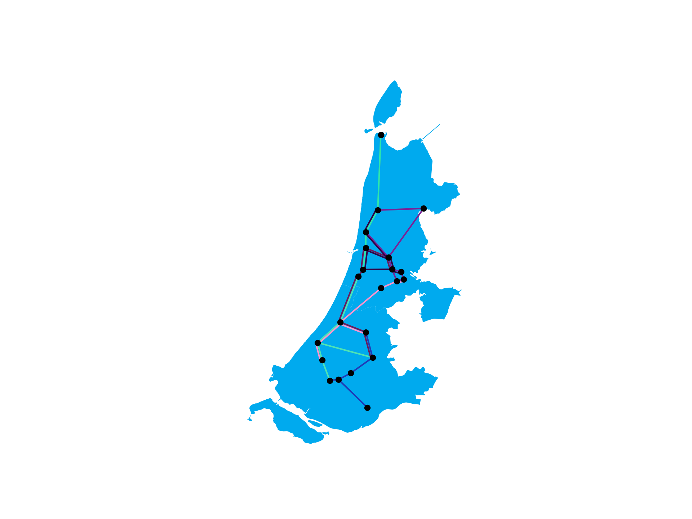

# RailNL - Shibayama (芝山)
-------------------------------------------
In the [RailNL](https://theorie.mprog.nl/cases/railnl) case, we're trying to optimize the line planning of trains. The case contains two sets of CSV-files, one for the stations and connections in Noord- and Zuid-Holland, and one for the stations and connections of the Netherlands. The goal is to get for both areas a covering network with a maximum of maxLines and where the duration of every line is not longer than maxTime.


|       Area      | nStations | nConnections | maxTime | maxLines |
|----------------:|:---------:|:------------:|:-------:|:--------:|
|   **Holland**   |     22    |      32      |   120   |    7     |
| **Netherlands** |     45    |      89      |   180   |    20    |

The quality of the solution can be measured using the following formula:


Where *p* is the percentage of the connections covered (between 0 and 1), *#Lines* is the number of lines used in the solution and *TotalTime* is the sum of the times of every line.


## Instructions

### Installation

The code used is completely written in Python 3.8 and all packages needed to run this program can be found in *requirements.txt*. You can use pip to install these packages with:

```
pip3 install -r requirements.txt
```

Or use conda:

```
conda install --file requirements.txt
```

### Usage
To run this program you could use the function main.py that needs 3 input arguments. First the name of an area is needed. You could use 'Holland' to calculate the lines for Noord- and Zuid-Holland and 'Nationaal' to calculate the lines of the Netherlands. The second argument needed is the Maximum number of minutes that a train can ride on a line. The last argument is the number of lines the function needs to calculate.

```
python3 main.py str:area int:maxminutes int:#lines
```

When filled in, it will look like:

```
python3 main.py "Holland" 120 7
```

### Output

When the function is started, it will return all the lines and number of minutes they take, a quality score of the lines combined, an output csv-file and an output map as png-file.

An example of terminal output of the above function is:

   <details><summary>Click to see Terminal Output</summary>
    <pre>
    381.0 28
    5.0 (Rotterdam Centraal at position (long: 51.92499924, lat: 4.46888876), Schiedam Centrum at position (long: 51.92124381, lat: 4.408993721))
    6.0 (Amsterdam Centraal at position (long: 52.37888718, lat: 4.900277615), Amsterdam Sloterdijk at position (long: 52.38888931, lat: 4.837777615))
    6.0 (Amsterdam Sloterdijk at position (long: 52.38888931, lat: 4.837777615), Zaandam at position (long: 52.43888855, lat: 4.813611031))
    6.0 (Amsterdam Zuid at position (long: 52.338889, lat: 4.872356), Schiphol Airport at position (long: 52.30944443, lat: 4.761944294))
    6.0 (Heemstede-Aerdenhout at position (long: 52.35916519, lat: 4.606666565), Haarlem at position (long: 52.38777924, lat: 4.638333321))
    7.0 (Schiedam Centrum at position (long: 51.92124381, lat: 4.408993721), Delft at position (long: 52.00666809, lat: 4.356389046))
    8.0 (Amsterdam Amstel at position (long: 52.34666824, lat: 4.917778015), Amsterdam Centraal at position (long: 52.37888718, lat: 4.900277615))
    8.0 (Rotterdam Centraal at position (long: 51.92499924, lat: 4.46888876), Rotterdam Alexander at position (long: 51.95194626, lat: 4.553611279))
    9.0 (Castricum at position (long: 52.54583359, lat: 4.658611298), Alkmaar at position (long: 52.63777924, lat: 4.739722252))
    10.0 (Amsterdam Amstel at position (long: 52.34666824, lat: 4.917778015), Amsterdam Zuid at position (long: 52.338889, lat: 4.872356))
    10.0 (Rotterdam Alexander at position (long: 51.95194626, lat: 4.553611279), Gouda at position (long: 52.01750183, lat: 4.704444408))
    11.0 (Amsterdam Sloterdijk at position (long: 52.38888931, lat: 4.837777615), Haarlem at position (long: 52.38777924, lat: 4.638333321))
    12.0 (Den Haag Centraal at position (long: 52.08027649, lat: 4.324999809), Leiden Centraal at position (long: 52.16611099, lat: 4.481666565))
    12.0 (Zaandam at position (long: 52.43888855, lat: 4.813611031), Castricum at position (long: 52.54583359, lat: 4.658611298))
    13.0 (Beverwijk at position (long: 52.47833252, lat: 4.656666756), Castricum at position (long: 52.54583359, lat: 4.658611298))
    13.0 (Delft at position (long: 52.00666809, lat: 4.356389046), Den Haag Centraal at position (long: 52.08027649, lat: 4.324999809))
    13.0 (Leiden Centraal at position (long: 52.16611099, lat: 4.481666565), Heemstede-Aerdenhout at position (long: 52.35916519, lat: 4.606666565))
    14.0 (Leiden Centraal at position (long: 52.16611099, lat: 4.481666565), Alphen a/d Rijn at position (long: 52.12444305, lat: 4.657777786))
    15.0 (Leiden Centraal at position (long: 52.16611099, lat: 4.481666565), Schiphol Airport at position (long: 52.30944443, lat: 4.761944294))
    16.0 (Amsterdam Zuid at position (long: 52.338889, lat: 4.872356), Amsterdam Sloterdijk at position (long: 52.38888931, lat: 4.837777615))
    16.0 (Haarlem at position (long: 52.38777924, lat: 4.638333321), Beverwijk at position (long: 52.47833252, lat: 4.656666756))
    17.0 (Dordrecht at position (long: 51.80722046, lat: 4.66833353), Rotterdam Centraal at position (long: 51.92499924, lat: 4.46888876))
    18.0 (Den Haag Centraal at position (long: 52.08027649, lat: 4.324999809), Gouda at position (long: 52.01750183, lat: 4.704444408))
    19.0 (Gouda at position (long: 52.01750183, lat: 4.704444408), Alphen a/d Rijn at position (long: 52.12444305, lat: 4.657777786))
    24.0 (Alkmaar at position (long: 52.63777924, lat: 4.739722252), Hoorn at position (long: 52.64472198, lat: 5.055555344))
    25.0 (Zaandam at position (long: 52.43888855, lat: 4.813611031), Beverwijk at position (long: 52.47833252, lat: 4.656666756))
    26.0 (Zaandam at position (long: 52.43888855, lat: 4.813611031), Hoorn at position (long: 52.64472198, lat: 5.055555344))
    36.0 (Alkmaar at position (long: 52.63777924, lat: 4.739722252), Den Helder at position (long: 52.95527649, lat: 4.761111259))
    [Dordrecht at position (long: 51.80722046, lat: 4.66833353), Rotterdam Centraal at position (long: 51.92499924, lat: 4.46888876), Rotterdam Alexander at position (long: 51.95194626, lat: 4.553611279), Gouda at position (long: 52.01750183, lat: 4.704444408), Den Haag Centraal at position (long: 52.08027649, lat: 4.324999809), Delft at position (long: 52.00666809, lat: 4.356389046), Schiedam Centrum at position (long: 51.92124381, lat: 4.408993721), Delft at position (long: 52.00666809, lat: 4.356389046), Schiedam Centrum at position (long: 51.92124381, lat: 4.408993721)]
    Duration 87 min
    [Amsterdam Centraal at position (long: 52.37888718, lat: 4.900277615), Amsterdam Sloterdijk at position (long: 52.38888931, lat: 4.837777615), Haarlem at position (long: 52.38777924, lat: 4.638333321), Beverwijk at position (long: 52.47833252, lat: 4.656666756), Zaandam at position (long: 52.43888855, lat: 4.813611031), Castricum at position (long: 52.54583359, lat: 4.658611298), Alkmaar at position (long: 52.63777924, lat: 4.739722252), Castricum at position (long: 52.54583359, lat: 4.658611298), Beverwijk at position (long: 52.47833252, lat: 4.656666756)]
    Duration 101 min
    [Hoorn at position (long: 52.64472198, lat: 5.055555344), Zaandam at position (long: 52.43888855, lat: 4.813611031), Beverwijk at position (long: 52.47833252, lat: 4.656666756), Castricum at position (long: 52.54583359, lat: 4.658611298), Beverwijk at position (long: 52.47833252, lat: 4.656666756), Castricum at position (long: 52.54583359, lat: 4.658611298), Alkmaar at position (long: 52.63777924, lat: 4.739722252)]
    Duration 99 min
    [Schiphol Airport at position (long: 52.30944443, lat: 4.761944294), Leiden Centraal at position (long: 52.16611099, lat: 4.481666565), Heemstede-Aerdenhout at position (long: 52.35916519, lat: 4.606666565), Haarlem at position (long: 52.38777924, lat: 4.638333321), Amsterdam Sloterdijk at position (long: 52.38888931, lat: 4.837777615), Amsterdam Centraal at position (long: 52.37888718, lat: 4.900277615), Amsterdam Sloterdijk at position (long: 52.38888931, lat: 4.837777615), Amsterdam Zuid at position (long: 52.338889, lat: 4.872356), Amsterdam Amstel at position (long: 52.34666824, lat: 4.917778015), Amsterdam Zuid at position (long: 52.338889, lat: 4.872356), Amsterdam Sloterdijk at position (long: 52.38888931, lat: 4.837777615), Zaandam at position (long: 52.43888855, lat: 4.813611031)]
    Duration 115 min
    [Amsterdam Zuid at position (long: 52.338889, lat: 4.872356), Schiphol Airport at position (long: 52.30944443, lat: 4.761944294), Amsterdam Zuid at position (long: 52.338889, lat: 4.872356), Amsterdam Sloterdijk at position (long: 52.38888931, lat: 4.837777615), Amsterdam Centraal at position (long: 52.37888718, lat: 4.900277615), Amsterdam Amstel at position (long: 52.34666824, lat: 4.917778015), Amsterdam Zuid at position (long: 52.338889, lat: 4.872356), Schiphol Airport at position (long: 52.30944443, lat: 4.761944294), Leiden Centraal at position (long: 52.16611099, lat: 4.481666565), Den Haag Centraal at position (long: 52.08027649, lat: 4.324999809), Gouda at position (long: 52.01750183, lat: 4.704444408), Rotterdam Alexander at position (long: 51.95194626, lat: 4.553611279)]
    Duration 113 min
    [Alphen a/d Rijn at position (long: 52.12444305, lat: 4.657777786), Leiden Centraal at position (long: 52.16611099, lat: 4.481666565), Den Haag Centraal at position (long: 52.08027649, lat: 4.324999809), Delft at position (long: 52.00666809, lat: 4.356389046), Schiedam Centrum at position (long: 51.92124381, lat: 4.408993721), Rotterdam Centraal at position (long: 51.92499924, lat: 4.46888876), Rotterdam Alexander at position (long: 51.95194626, lat: 4.553611279), Gouda at position (long: 52.01750183, lat: 4.704444408), Alphen a/d Rijn at position (long: 52.12444305, lat: 4.657777786), Gouda at position (long: 52.01750183, lat: 4.704444408)]
    Duration 107 min
    [Alkmaar at position (long: 52.63777924, lat: 4.739722252), Hoorn at position (long: 52.64472198, lat: 5.055555344), Alkmaar at position (long: 52.63777924, lat: 4.739722252), Castricum at position (long: 52.54583359, lat: 4.658611298), Alkmaar at position (long: 52.63777924, lat: 4.739722252), Den Helder at position (long: 52.95527649, lat: 4.761111259)]
    Duration 102 min
    K-score 8576
    sections traversed 28/28
    tries 2828
    Searching for map of Holland.
    Map-Holland is created.
    12.4695594 s
    </pre>
   </details>

And an example of the output map will look like:



### Structure
All the important folders and files are structured below:

- **/code**:contains all code.
    - **/code/algorithms**: contains code to draw lines.
    - **code/classes**: contains all classes.
    - **code/data_loader**: contains code to load data.
    - **code/visualization**: contains code to plot results.
- **/data**: contains csv-files of RailNL case.
    - **/data/shapefile**: contains shapefile to draw (parts of) the Netherlands.
- **/output**: contains (examples of) output-files.
    

## Authors
- Dani van Enk
- Michael Faber